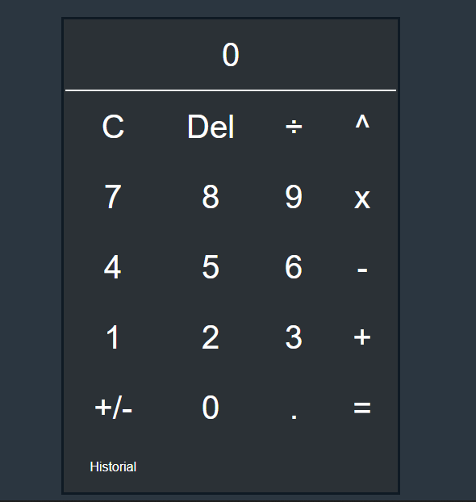
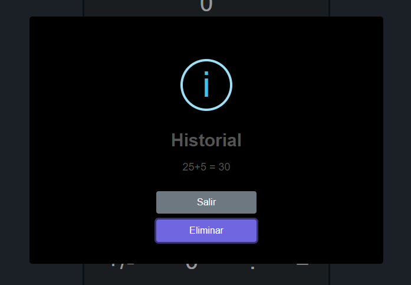

# Tarea #2 Calculadora Web Con Historial

# Realizar una calculadora web que contenga lo siguinete:
- Suma
- Resta
- Multiplicacion
- Division
- Potenciacion
- Pueda borrar
- Historial
- Eliminar el historial
- Utilizar HTML, CSS y JavaScript